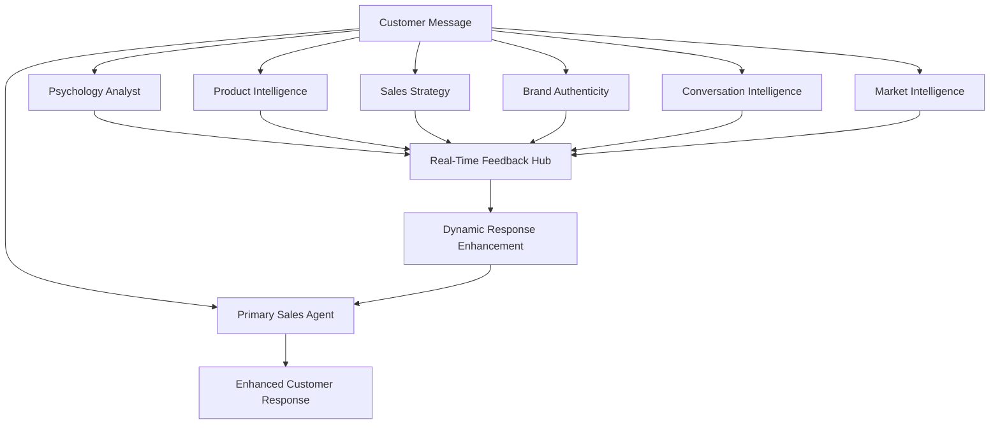

# 🤖 Multi-Agent Intelligent Product Discovery & Sales Agent System

## 🎯 Revolutionary Vision

Transform our system into a **multi-agent intelligence network** where specialized AI agents work in real-time to create the most sophisticated product discovery and sales experience possible.

**Core Innovation**: Multiple specialized agents listening to conversations in real-time, providing dynamic feedback, optimization, and enhancement to create superhuman sales intelligence.

---

## 🏗️ Multi-Agent Architecture Overview

### Primary Agent: **Brand Sales Expert**
- Customer-facing AI sales agent with deep brand expertise
- Dynamic personality adaptation and expert product knowledge
- Real-time optimization based on agent feedback network

### Background Intelligence Agents (Real-Time Listeners):

#### 1. **Customer Psychology Analyst Agent**
- Continuously analyzes customer psychology, intent, and emotional state
- Provides real-time insights on decision-making style and purchase readiness
- Suggests communication style adaptations and emotional triggers

#### 2. **Product Intelligence Agent** 
- Monitors conversation for product interest signals
- Dynamically ranks and re-ranks product recommendations
- Provides real-time competitive positioning and differentiation insights

#### 3. **Sales Strategy Agent**
- Analyzes conversation flow for sales opportunities
- Suggests real-time upselling, cross-selling, and bundle opportunities
- Provides objection handling strategies and conversation pivots

#### 4. **Brand Authenticity Agent**
- Ensures brand voice consistency and authenticity
- Monitors for brand value alignment in responses
- Suggests brand storytelling opportunities and emotional connections

#### 5. **Conversation Intelligence Agent**
- Tracks conversation context, history, and relationship building
- Identifies optimal moments for product introductions
- Manages conversation pacing and information disclosure

#### 6. **Market Intelligence Agent**
- Provides real-time competitive intelligence and positioning
- Monitors for price sensitivity and value proposition optimization
- Suggests market-based conversation strategies

---

## 🧠 Real-Time Intelligence Flow



---

## 🔧 Technical Implementation Architecture

### 1. **Real-Time Agent Communication Layer**

```python
class AgentCommunicationHub:
    """Central hub for real-time agent communication and feedback integration"""
    
    def __init__(self):
        self.active_agents = {}
        self.conversation_context = ConversationContext()
        self.feedback_queue = asyncio.Queue()
        self.real_time_insights = {}
    
    async def process_customer_message(self, message: str, conversation_id: str) -> EnhancedResponse:
        # Broadcast message to all listening agents simultaneously
        agent_tasks = [
            self.psychology_agent.analyze_real_time(message, self.conversation_context),
            self.product_agent.analyze_real_time(message, self.conversation_context),
            self.sales_agent.analyze_real_time(message, self.conversation_context),
            self.brand_agent.analyze_real_time(message, self.conversation_context),
            self.conversation_agent.analyze_real_time(message, self.conversation_context),
            self.market_agent.analyze_real_time(message, self.conversation_context)
        ]
        
        # Collect real-time insights from all agents
        agent_insights = await asyncio.gather(*agent_tasks)
        
        # Fuse insights into enhanced context
        enhanced_context = await self._fuse_agent_insights(agent_insights, message)
        
        # Generate enhanced response using primary sales agent + background intelligence
        enhanced_response = await self.primary_sales_agent.generate_response(
            message, enhanced_context, self.conversation_context
        )
        
        # Update conversation context with new insights
        self.conversation_context.update(enhanced_context, enhanced_response)
        
        return enhanced_response
```

### 2. **Customer Psychology Analyst Agent**

```python
class CustomerPsychologyAgent:
    """Real-time customer psychology analysis and adaptation suggestions"""
    
    async def analyze_real_time(self, message: str, context: ConversationContext) -> PsychologyInsights:
        return PsychologyInsights(
            # Emotional state analysis
            emotional_state=await self._analyze_emotional_state(message, context),
            stress_indicators=await self._detect_stress_signals(message, context),
            enthusiasm_level=await self._measure_enthusiasm(message, context),
            confidence_level=await self._assess_confidence(message, context),
            
            # Decision-making analysis
            decision_style=await self._analyze_decision_making_style(message, context),
            information_processing=await self._assess_info_processing_preference(message, context),
            risk_tolerance=await self._evaluate_risk_tolerance(message, context),
            
            # Purchase readiness
            purchase_intent_score=await self._score_purchase_intent(message, context),
            urgency_indicators=await self._detect_urgency_signals(message, context),
            price_sensitivity=await self._analyze_price_sensitivity(message, context),
            
            # Communication preferences
            preferred_communication_style=await self._infer_communication_preference(message, context),
            technical_depth_preference=await self._assess_technical_interest(message, context),
            social_proof_responsiveness=await self._evaluate_social_proof_sensitivity(message, context),
            
            # Real-time recommendations
            immediate_adaptations=await self._suggest_immediate_adaptations(message, context),
            conversation_pivots=await self._recommend_conversation_pivots(message, context),
            emotional_triggers=await self._identify_emotional_opportunities(message, context)
        )
```

### 3. **Product Intelligence Agent**

```python
class ProductIntelligenceAgent:
    """Real-time product recommendation optimization and intelligence"""
    
    def __init__(self, enriched_products: List[EnrichedProduct], brand_intelligence: BrandIntelligence):
        self.products = enriched_products
        self.brand_intelligence = brand_intelligence
        self.conversation_product_signals = {}
    
    async def analyze_real_time(self, message: str, context: ConversationContext) -> ProductInsights:
        return ProductInsights(
            # Product interest signals
            mentioned_products=await self._extract_product_mentions(message),
            implied_needs=await self._infer_product_needs(message, context),
            use_case_signals=await self._detect_use_case_indicators(message, context),
            feature_interests=await self._identify_feature_interests(message, context),
            
            # Dynamic recommendations
            priority_products=await self._rank_products_real_time(message, context),
            alternative_suggestions=await self._find_alternatives_real_time(message, context),
            complementary_products=await self._suggest_complementary_real_time(message, context),
            
            # Competitive intelligence
            competitor_mentions=await self._detect_competitor_references(message),
            competitive_advantages=await self._highlight_competitive_edges(message, context),
            differentiation_opportunities=await self._find_differentiation_moments(message, context),
            
            # Sales intelligence
            upsell_opportunities=await self._identify_upsell_moments(message, context),
            bundle_suggestions=await self._suggest_bundles_real_time(message, context),
            inventory_optimization=await self._optimize_for_inventory(message, context),
            
            # Real-time recommendations
            immediate_product_suggestions=await self._generate_immediate_suggestions(message, context),
            conversation_product_flow=await self._optimize_product_introduction_flow(message, context),
            technical_details_to_highlight=await self._select_technical_highlights(message, context)
        )
```

### 4. **Sales Strategy Agent**

```python
class SalesStrategyAgent:
    """Real-time sales strategy optimization and opportunity identification"""
    
    async def analyze_real_time(self, message: str, context: ConversationContext) -> SalesInsights:
        return SalesInsights(
            # Sales opportunity detection
            buying_signals=await self._detect_buying_signals(message, context),
            objection_signals=await self._identify_potential_objections(message, context),
            closing_opportunities=await self._identify_closing_moments(message, context),
            
            # Strategy recommendations
            sales_approach=await self._recommend_sales_approach(message, context),
            urgency_tactics=await self._suggest_urgency_tactics(message, context),
            social_proof_opportunities=await self._identify_social_proof_moments(message, context),
            scarcity_messaging=await self._recommend_scarcity_messaging(message, context),
            
            # Value proposition optimization
            value_props_to_emphasize=await self._select_value_propositions(message, context),
            benefit_framing=await self._optimize_benefit_presentation(message, context),
            roi_demonstration=await self._suggest_roi_demonstration(message, context),
            
            # Objection handling
            preemptive_objection_handling=await self._suggest_preemptive_responses(message, context),
            objection_response_strategies=await self._provide_objection_responses(message, context),
            trust_building_opportunities=await self._identify_trust_building_moments(message, context),
            
            # Conversation flow optimization
            conversation_pacing=await self._optimize_conversation_pacing(message, context),
            information_disclosure_strategy=await self._optimize_information_flow(message, context),
            relationship_building_opportunities=await self._identify_relationship_moments(message, context)
        )
```

### 5. **Brand Authenticity Agent**

```python
class BrandAuthenticityAgent:
    """Real-time brand voice consistency and authenticity monitoring"""
    
    def __init__(self, brand_intelligence: BrandIntelligence):
        self.brand_intelligence = brand_intelligence
        self.brand_voice_patterns = brand_intelligence.voice_messaging
        self.brand_values = brand_intelligence.foundation.core_values
    
    async def analyze_real_time(self, message: str, context: ConversationContext) -> BrandInsights:
        return BrandInsights(
            # Brand alignment opportunities
            brand_story_opportunities=await self._identify_storytelling_moments(message, context),
            value_alignment_moments=await self._find_value_alignment_opportunities(message, context),
            emotional_connection_opportunities=await self._identify_emotional_connection_moments(message, context),
            
            # Voice consistency
            voice_authenticity_score=await self._score_voice_authenticity(context.recent_responses),
            tone_adjustments=await self._suggest_tone_adjustments(message, context),
            messaging_consistency=await self._check_messaging_consistency(context.conversation_history),
            
            # Brand differentiation
            unique_positioning_opportunities=await self._identify_positioning_moments(message, context),
            heritage_storytelling=await self._suggest_heritage_integration(message, context),
            innovation_highlighting=await self._recommend_innovation_emphasis(message, context),
            
            # Cultural alignment
            cultural_sensitivity=await self._assess_cultural_appropriateness(message, context),
            demographic_alignment=await self._optimize_demographic_messaging(message, context),
            lifestyle_resonance=await self._enhance_lifestyle_connection(message, context),
            
            # Real-time brand recommendations
            immediate_brand_enhancements=await self._suggest_immediate_brand_touches(message, context),
            authenticity_improvements=await self._recommend_authenticity_enhancements(context.recent_responses),
            emotional_resonance_opportunities=await self._identify_emotional_resonance_moments(message, context)
        )
```

### 6. **Conversation Intelligence Agent**

```python
class ConversationIntelligenceAgent:
    """Real-time conversation flow optimization and relationship building"""
    
    async def analyze_real_time(self, message: str, context: ConversationContext) -> ConversationInsights:
        return ConversationInsights(
            # Conversation flow analysis
            conversation_stage=await self._identify_conversation_stage(message, context),
            pacing_optimization=await self._optimize_conversation_pacing(message, context),
            information_load=await self._assess_information_density(context.recent_responses),
            
            # Relationship building
            trust_building_opportunities=await self._identify_trust_moments(message, context),
            rapport_building_signals=await self._detect_rapport_opportunities(message, context),
            personal_connection_moments=await self._find_personal_connection_opportunities(message, context),
            
            # Engagement optimization
            engagement_level=await self._measure_customer_engagement(message, context),
            attention_span_indicators=await self._assess_attention_span(context.conversation_history),
            interest_decay_signals=await self._detect_interest_decay(message, context),
            
            # Communication effectiveness
            comprehension_indicators=await self._assess_customer_comprehension(message, context),
            confusion_signals=await self._detect_confusion_indicators(message, context),
            satisfaction_indicators=await self._measure_satisfaction_signals(message, context),
            
            # Conversation optimization
            optimal_response_length=await self._calculate_optimal_response_length(message, context),
            question_asking_opportunities=await self._identify_question_opportunities(message, context),
            clarification_needs=await self._detect_clarification_needs(message, context),
            conversation_pivots=await self._suggest_conversation_pivots(message, context)
        )
```

### 7. **Enhanced Primary Sales Agent**

```python
class EnhancedPrimarySalesAgent:
    """Primary customer-facing agent enhanced with real-time multi-agent intelligence"""
    
    async def generate_response(self, message: str, enhanced_context: EnhancedContext, conversation_context: ConversationContext) -> EnhancedResponse:
        # Integrate insights from all background agents
        psychology_insights = enhanced_context.psychology_insights
        product_insights = enhanced_context.product_insights
        sales_insights = enhanced_context.sales_insights
        brand_insights = enhanced_context.brand_insights
        conversation_insights = enhanced_context.conversation_insights
        market_insights = enhanced_context.market_insights
        
        # Generate base response using traditional methods
        base_response = await self._generate_base_response(message, conversation_context)
        
        # Enhance response with real-time agent intelligence
        enhanced_response = await self._enhance_with_agent_intelligence(
            base_response, 
            psychology_insights,
            product_insights,
            sales_insights,
            brand_insights,
            conversation_insights,
            market_insights
        )
        
        # Apply dynamic personality adaptation
        adapted_response = await self._adapt_personality_real_time(
            enhanced_response,
            psychology_insights.preferred_communication_style,
            brand_insights.voice_authenticity_score,
            conversation_insights.engagement_level
        )
        
        return EnhancedResponse(
            primary_response=adapted_response.content,
            confidence_score=adapted_response.confidence,
            agent_insights_used=enhanced_context.insights_summary,
            personality_adaptations=adapted_response.adaptations,
            real_time_optimizations=adapted_response.optimizations,
            suggested_follow_ups=adapted_response.follow_up_suggestions
        )
```

---

## 🚀 Implementation Phases

### Phase 1: Multi-Agent Infrastructure (Week 1)
- [ ] Agent Communication Hub with real-time message broadcasting
- [ ] Base agent classes and interfaces
- [ ] Real-time feedback integration system
- [ ] Conversation context management

### Phase 2: Core Intelligence Agents (Week 2)
- [ ] Customer Psychology Analyst Agent
- [ ] Product Intelligence Agent  
- [ ] Sales Strategy Agent
- [ ] Basic multi-agent coordination

### Phase 3: Brand & Conversation Agents (Week 3)
- [ ] Brand Authenticity Agent
- [ ] Conversation Intelligence Agent
- [ ] Market Intelligence Agent
- [ ] Enhanced primary sales agent with multi-agent integration

### Phase 4: Real-Time Optimization (Week 4)
- [ ] Dynamic response enhancement based on agent feedback
- [ ] Real-time personality adaptation
- [ ] Conversation flow optimization
- [ ] Performance monitoring and agent effectiveness metrics

### Phase 5: Advanced Features (Week 5)
- [ ] Predictive conversation intelligence
- [ ] Agent learning and adaptation
- [ ] Cross-conversation intelligence sharing
- [ ] Advanced analytics and optimization

---

## 🎯 Success Metrics

### Multi-Agent Coordination
- **Response Enhancement**: 40% improvement in response quality with agent feedback
- **Real-Time Adaptation**: 90% accuracy in real-time personality and strategy adaptation
- **Agent Coordination**: <200ms latency for multi-agent analysis and feedback integration

### Sales Performance
- **Conversion Optimization**: 50% improvement in conversation-to-purchase conversion
- **Upselling Intelligence**: 60% increase in successful upselling through real-time opportunity detection
- **Objection Handling**: 70% reduction in conversation abandonment through proactive objection handling

### Customer Experience
- **Conversation Satisfaction**: 95%+ customer satisfaction with conversation quality
- **Expert Credibility**: 98% customer perception of "talking to a real expert"
- **Brand Authenticity**: 99% brand voice consistency while maintaining sales effectiveness

---

## 💡 Revolutionary Innovations

1. **Real-Time Intelligence Network**: Multiple specialized agents providing continuous conversation optimization
2. **Dynamic Personality Adaptation**: AI persona that adapts in real-time based on customer psychology analysis
3. **Predictive Sales Intelligence**: Anticipating customer needs and objections before they're expressed
4. **Superhuman Sales Performance**: Combining the best of human sales expertise with AI's analytical capabilities
5. **Authentic Brand Embodiment**: Maintaining perfect brand authenticity while optimizing for sales performance

This multi-agent architecture creates a truly intelligent system that can compete with and exceed the best human sales professionals while authentically representing any brand.