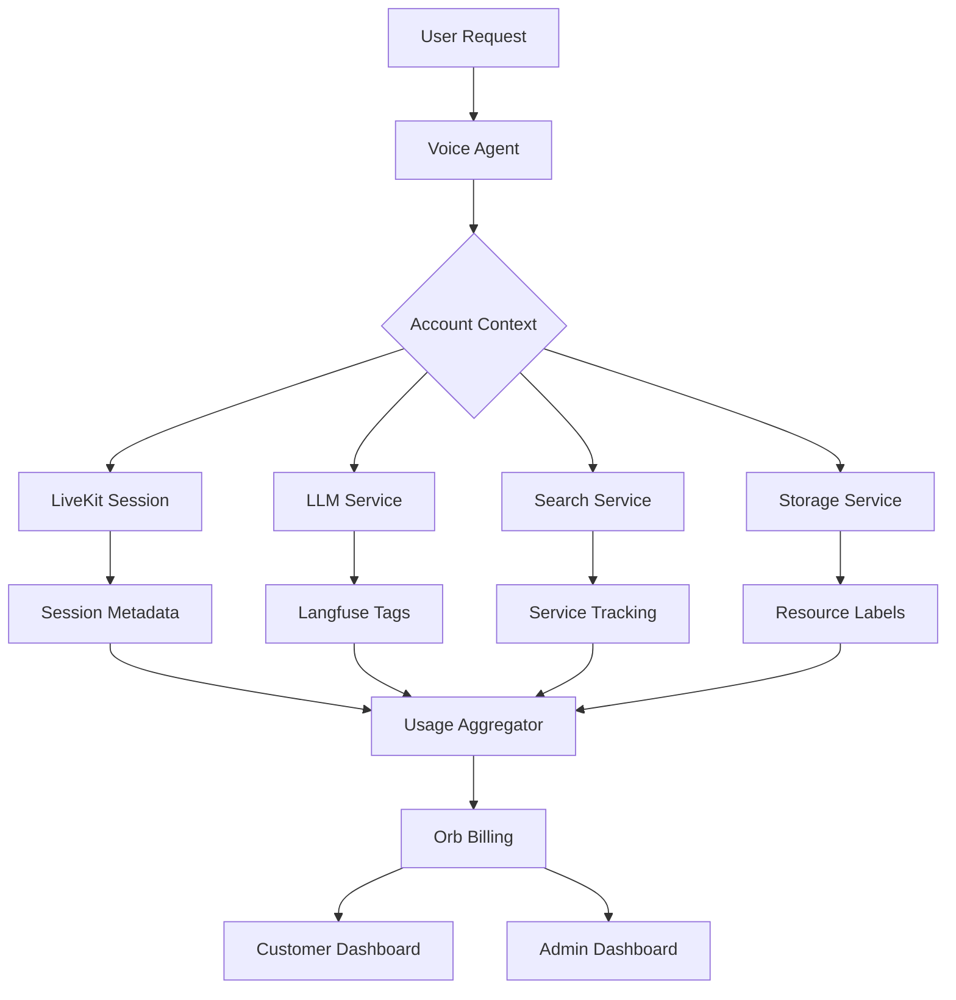

# Billing System Implementation Plan

## Overview

This document outlines the implementation plan for a comprehensive billing system that tracks usage across all integrated services and bills customers at $8/hour based on conversation time. The key innovation is using **account-based tagging** rather than per-customer API keys, which simplifies key management while maintaining accurate billing attribution.

## Core Architecture Principles

1. **Shared API Keys**: Use a single set of API keys for all customers
2. **Account Tagging**: Tag every API request with the customer's account identifier
3. **Unified Tracking**: Leverage Langfuse for observability and feed data to Orb for billing
4. **Conversation-Based Billing**: Bill at $8/hour based on total conversation time from LiveKit

## Service Integration Matrix

| Service | Purpose | Current Integration | Billing Integration Plan |
|---------|---------|-------------------|-------------------------|
| **LiveKit** | Voice/WebRTC | `voice_agent.py` | Name session with account (session id must still be unique), track duration |
| **OpenAI** | LLM (GPT models) | Langfuse wrapper exists | Ensure account tags in all calls |
| **Anthropic** | LLM (Claude) | Basic service | Add Langfuse wrapper with account tags |
| **Google Gemini** | LLM | Basic service | Add Langfuse wrapper with account tags |
| **AssemblyAI** | Speech-to-Text | LiveKit plugin | Track via LiveKit session metadata |
| **DeepGram** | Speech-to-Text | LiveKit plugin | Track via LiveKit session metadata |
| **ElevenLabs** | Text-to-Speech | LiveKit plugin | Track via LiveKit session metadata |
| **Pinecone** | Vector DB | `search/pinecone.py` | Add account to metadata field |
| **Tavily** | Web Search | `web_search.py` | Wrap API calls with tracking |
| **Google Cloud** | Storage/Compute | Multiple locations | Use resource labels for attribution |

## Implementation Phases

### Phase 1: Langfuse Account Tagging (Week 1)

**Goal**: Ensure all LLM calls are tagged with account information for tracking

1. **Enhance Voice Package** (Already partially complete)
   - ✅ `langfuse_llm.py` already captures account metadata
   - Add user/session tracking for granular attribution
   - Ensure all voice-initiated LLM calls include account tags

2. **Add Langfuse to Intelligence Package**
   ```python
   # packages/liddy/llm/langfuse_wrapper.py
   class LangfuseWrapper:
       """Generic wrapper to add Langfuse tracking to any LLM service"""
       def __init__(self, service: LLMModelService, account: str, user: Optional[str] = None):
           self.service = service
           self.account = account
           self.user = user
       
       @observe()
       async def chat_with_options(self, messages, **kwargs):
           # Add account/user to Langfuse context
           langfuse_context.update_current_observation(
               metadata={"account": self.account, "user": self.user}
           )
           return await self.service.chat_with_options(messages, **kwargs)
   ```

3. **Update LLMFactory**
   ```python
   # packages/liddy/llm/simple_factory.py
   def get_service(
       self,
       model_or_engine: str,
       account: Optional[str] = None,
       user: Optional[str] = None
   ) -> LLMModelService:
       service = self._create_base_service(model_or_engine)
       
       if LANGFUSE_ENABLED and account:
           return LangfuseWrapper(service, account, user)
       
       return service
   ```

4. **Update All Research Components**
   - Pass account (brand_domain) through all LLM service creation
   - Update `BaseResearcher`, `QualityEvaluator`, etc.
   - Ensure account context flows through entire pipeline

### Phase 2: External Service Tracking (Week 2)

**Goal**: Track usage of non-LLM services with account attribution

1. **LiveKit Session Metadata**
   ```python
   # packages/liddy_voice/voice_agent.py
   class VoiceAssistant:
       async def _initialize_livkit(self):
           # Add account metadata to LiveKit session
           await self.ctx.connect(
               ws_url,
               token,
               options=rtc.ConnectOptions(
                   metadata=json.dumps({
                       "account": self.account,
                       "user": self.user_id,
                       "session_start": datetime.now().isoformat()
                   })
               )
           )
   ```

2. **Pinecone Account Tagging**
   ```python
   # packages/liddy/search/pinecone.py
   class PineconeSearchService:
       def __init__(self, account: str, ...):
           self.account = account
           # Initialize with source_tag that includes account
           self.pc = Pinecone(
               api_key=api_key,
               source_tag=f"liddy-search-{account}"
           )
       
       async def query(self, ...):
           # Include account in query metadata
           results = await index.query(
               vector=query_vector,
               metadata_filter={"account": self.account},
               include_metadata=True
           )
   ```

3. **Web Search Tracking**
   ```python
   # packages/liddy_intelligence/web_search.py
   class TavilySearchService:
       def __init__(self, account: str):
           self.account = account
           self.usage_tracker = UsageTracker()
       
       async def search(self, query: str):
           # Track usage before API call
           await self.usage_tracker.track(
               account=self.account,
               service="tavily",
               operation="search",
               units=1,
               unit_type="query"
           )
           return await self._tavily_search(query)
   ```

4. **Google Cloud Resource Labels**
   ```bash
   # Add labels to all GCS operations
   gsutil label ch -l "account:specialized-com" gs://bucket/path
   
   # Use labels in API calls
   blob.metadata = {"account": account}
   ```

### Phase 3: Usage Aggregation & Billing Platform (Week 3)

**Goal**: Aggregate usage data and integrate with Orb for billing

1. **Create Usage Aggregation Service**
   ```python
   # packages/liddy/billing/usage_aggregator.py
   class UsageAggregator:
       """Collects usage from multiple sources and sends to Orb"""
       
       async def collect_hourly_usage(self):
           # Collect from Langfuse
           llm_usage = await self.get_langfuse_usage()
           
           # Collect from LiveKit
           voice_usage = await self.get_livekit_usage()
           
           # Collect from custom trackers
           service_usage = await self.get_service_usage()
           
           # Send to Orb
           await self.send_to_orb(llm_usage, voice_usage, service_usage)
   ```

2. **Orb Integration**
   ```python
   # packages/liddy/billing/orb_client.py
   class OrbBillingClient:
       def __init__(self):
           self.client = orb.Client(api_key=ORB_API_KEY)
       
       async def ingest_usage(self, account: str, usage_events: List[UsageEvent]):
           # Convert to Orb events
           orb_events = [
               {
                   "customer_id": account,
                   "event_name": "api_usage",
                   "properties": {
                       "service": event.service,
                       "units": event.units,
                       "unit_type": event.unit_type
                   },
                   "timestamp": event.timestamp
               }
               for event in usage_events
           ]
           
           # Batch ingest
           await self.client.events.ingest(events=orb_events)
   ```

3. **Configure Orb Pricing**
   - Set up billable metrics in Orb dashboard
   - Create pricing model: $8/hour for conversation time
   - Configure service cost pass-through (optional)
   - Set up customer-specific rates if needed

### Phase 4: Customer Dashboards (Week 4)

**Goal**: Provide visibility into usage and costs for both admins and customers

1. **Admin Dashboard API**
   ```python
   # packages/liddy_voice/api/admin_billing.py
   @router.get("/admin/billing/overview")
   async def get_billing_overview():
       """Returns cost breakdown for all customers"""
       return {
           "customers": [
               {
                   "account": "specialized.com",
                   "current_month_cost": 1250.00,
                   "conversation_hours": 156.25,
                   "service_breakdown": {
                       "openai": {"cost": 125.50, "tokens": 2.5e6},
                       "assemblyai": {"cost": 89.20, "minutes": 892},
                       "pinecone": {"cost": 45.00, "queries": 15000},
                       # etc...
                   }
               }
           ]
       }
   ```

2. **Customer Portal API**
   ```python
   # packages/liddy_voice/api/customer_billing.py
   @router.get("/billing/usage")
   async def get_customer_usage(account: str = Depends(get_current_account)):
       """Returns simple usage view for customer"""
       return {
           "account": account,
           "current_month": {
               "conversation_hours": 156.25,
               "total_cost": 1250.00,  # 156.25 * $8
               "daily_average": 41.67
           },
           "usage_by_day": [...],
           "projected_monthly_cost": 1850.00
       }
   ```

3. **Usage Alerts**
   ```python
   # packages/liddy/billing/alerts.py
   class UsageAlertService:
       async def check_usage_limits(self, account: str):
           usage = await self.get_current_usage(account)
           limits = await self.get_account_limits(account)
           
           if usage.monthly_cost > limits.soft_limit * 0.8:
               await self.send_alert(
                   account,
                   f"Approaching monthly limit: ${usage.monthly_cost:.2f} of ${limits.soft_limit:.2f}"
               )
   ```

## Implementation Details

### Account Context Flow



### Usage Event Schema

```python
@dataclass
class UsageEvent:
    account: str
    service: str  # openai, assemblyai, pinecone, etc.
    operation: str  # chat, transcribe, query, etc.
    units: float  # tokens, seconds, queries, etc.
    unit_type: str  # tokens, seconds, queries, bytes
    timestamp: datetime
    user_id: Optional[str] = None
    session_id: Optional[str] = None
    metadata: Dict[str, Any] = field(default_factory=dict)
```

### Pricing Model

1. **Customer Pricing**: $8/hour based on conversation time
2. **Internal Cost Tracking** (for margin analysis):
   - OpenAI: Actual token costs
   - AssemblyAI: $0.01/minute
   - DeepGram: $0.0125/minute
   - ElevenLabs: Character-based pricing
   - Pinecone: Query-based pricing
   - GCS: Storage + egress costs

### Migration Strategy

1. **Phase 0: Preparation**
   - Set up Orb account and configure pricing
   - Create test customers in Orb
   - Deploy Langfuse if not already running

2. **Phase 1: Silent Tracking**
   - Implement account tagging
   - Start collecting usage data
   - Don't bill customers yet
   - Validate data accuracy

3. **Phase 2: Parallel Run**
   - Continue manual billing
   - Run automated billing in parallel
   - Compare results
   - Fix any discrepancies

4. **Phase 3: Cutover**
   - Switch to automated billing
   - Provide customer portal access
   - Monitor for issues
   - Keep manual process as backup

## Testing Strategy

1. **Unit Tests**
   - Test each wrapper/tracker in isolation
   - Mock external services
   - Verify account tags are properly propagated

2. **Integration Tests**
   - Test full flow from request to billing event
   - Verify data reaches Langfuse and Orb
   - Test error handling and retries

3. **Load Tests**
   - Simulate high-volume usage
   - Ensure aggregation performs well
   - Test Orb API rate limits

4. **Billing Accuracy Tests**
   - Compare automated calculations with manual
   - Verify conversation time tracking
   - Test edge cases (partial hours, disconnections)

## Security Considerations

1. **API Key Management**
   - Use environment variables for all keys
   - Rotate keys regularly
   - Monitor for unauthorized usage

2. **Account Isolation**
   - Ensure customers can only see their own data
   - Validate account context at every layer
   - Audit log all billing operations

3. **Data Privacy**
   - Don't log sensitive conversation content
   - Aggregate usage data appropriately
   - Comply with data retention policies

## Monitoring & Alerts

1. **Usage Anomalies**
   - Alert on sudden usage spikes
   - Monitor for unusual patterns
   - Track failed API calls

2. **Billing Health**
   - Monitor Orb ingestion success
   - Track aggregation job performance
   - Alert on missing usage data

3. **Cost Tracking**
   - Daily cost summaries
   - Margin analysis per customer
   - Service cost trends

## Future Enhancements

1. **Tiered Pricing**
   - Volume discounts for high usage
   - Premium features at higher rates
   - Custom pricing agreements

2. **Advanced Analytics**
   - Usage patterns by time of day
   - Popular features by customer
   - Cost optimization recommendations

3. **Self-Service Features**
   - Usage limits configuration
   - Billing alerts preferences
   - Invoice customization

## Notes for Implementation

### Quick Start Checklist

- [ ] Set up Orb account and API keys
- [ ] Configure Langfuse for production use
- [ ] Add account parameter to LLMFactory
- [ ] Update voice agent to pass account context
- [ ] Implement usage aggregation service
- [ ] Create customer dashboard endpoints
- [ ] Test with a pilot customer
- [ ] Document customer onboarding process

### Key Files to Modify

1. **Core Infrastructure**
   - `packages/liddy/llm/simple_factory.py` - Add account support
   - `packages/liddy/llm/langfuse_wrapper.py` - New file for wrapping
   - `packages/liddy/billing/` - New billing package

2. **Voice Package**
   - `packages/liddy_voice/voice_agent.py` - Add LiveKit metadata
   - `packages/liddy_voice/api/` - Add billing endpoints

3. **Intelligence Package**
   - `packages/liddy_intelligence/research/base_researcher.py` - Pass account
   - `packages/liddy_intelligence/web_search.py` - Add tracking

4. **Search Package**
   - `packages/liddy/search/pinecone.py` - Add account tagging
   - `packages/liddy/search/service.py` - Pass account context

### Environment Variables

```bash
# Billing Configuration
ORB_API_KEY=orb_live_xxxxx
ORB_WEBHOOK_SECRET=whsec_xxxxx

# Langfuse Configuration
LANGFUSE_SECRET_KEY=sk-lf-xxxxx
LANGFUSE_PUBLIC_KEY=pk-lf-xxxxx
LANGFUSE_HOST=https://cloud.langfuse.com

# Billing Settings
BILLING_HOURLY_RATE=8.00
BILLING_AGGREGATION_INTERVAL=3600  # seconds
BILLING_USAGE_RETENTION_DAYS=90
```

### Common Pitfalls to Avoid

1. **Don't Forget Edge Cases**
   - Disconnected sessions
   - Failed API calls that still incur costs
   - Retries that double-bill

2. **Performance Considerations**
   - Batch usage events to reduce API calls
   - Use async operations for tracking
   - Don't block main application flow

3. **Data Consistency**
   - Handle timezone differences
   - Ensure idempotent usage reporting
   - Reconcile discrepancies daily

## Conclusion

This billing system provides a scalable, maintainable solution for tracking usage across all services while maintaining simple $8/hour billing for customers. The account-tagging approach eliminates the complexity of per-customer API keys while providing detailed cost attribution for internal analysis.

The phased implementation allows for gradual rollout with minimal risk, and the integration with established platforms (Langfuse, Orb) provides a robust foundation for growth.