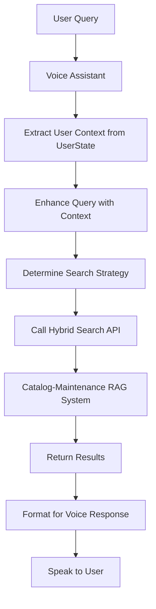

# RAG Integration Guide for Voice Assistant

## Overview

This guide shows how to integrate the advanced RAG system from catalog-maintenance into the voice assistant platform. The integration leverages the existing UserState system while adding RAG-specific optimizations.

## Key Integration Points

### 1. **Hybrid Search Integration**

The new RAG system provides hybrid search (dense + sparse embeddings) which significantly improves product discovery accuracy. To integrate:

```python
# In sample_assistant.py, update the product_search method:

async def product_search(self, query: str):
    """Enhanced product search using hybrid RAG."""
    
    # Use the enhanced search service
    from enhanced_search_service import EnhancedSearchService
    
    # Get enhanced query and filters with user context
    enhanced_query, extracted_filters = await EnhancedSearchService.enhance_product_query_with_user_context(
        query=query,
        user_state=self.session.userdata,
        chat_ctx=self.chat_ctx,
        account=self._account,
        product_knowledge=self._prompt_manager.product_search_knowledge or ""
    )
    
    # Determine search weights based on user preferences
    dense_weight, sparse_weight = EnhancedSearchService.determine_search_weights(
        query=enhanced_query,
        user_state=self.session.userdata,
        filters=extracted_filters
    )
    
    # Call the hybrid search endpoint (from catalog-maintenance)
    # This would be exposed via API from the catalog-maintenance service
    results = await self._call_hybrid_search_api(
        query=enhanced_query,
        filters=extracted_filters,
        dense_weight=dense_weight,
        sparse_weight=sparse_weight,
        top_k=10
    )
    
    return results
```

### 2. **UserState Enhancements**

While the current UserState works well, we can progressively enhance it:

#### Phase 1: Use Existing Fields (Immediate)
```python
# Extract preferences from existing fields
user_context = {
    'communication_style': user_state.communication_directive,
    'sentiment': user_state.sentiment_analysis,
    'previous_session': user_state.conversation_exit_state
}
```

#### Phase 2: Add RAG Fields (Future)
```python
# Extend UserState model
@dataclass
class UserState:
    # ... existing fields ...
    
    # RAG enhancements (optional fields for compatibility)
    search_preferences: Optional[Dict[str, Any]] = None
    search_history: Optional[List[Dict[str, Any]]] = None
    product_interaction_history: Optional[List[Dict[str, Any]]] = None
```

### 3. **API Endpoints to Catalog-Maintenance**

The catalog-maintenance service should expose these endpoints:

```python
# Hybrid Search Endpoint
POST /api/search
{
    "query": "carbon road bike under $3000",
    "filters": {
        "category": "road",
        "price": {"max": 3000}
    },
    "dense_weight": 0.6,
    "sparse_weight": 0.4,
    "user_context": {
        "preferred_brands": ["Specialized", "Trek"],
        "recent_searches": ["road bike", "carbon frame"]
    }
}

# Sync Status Endpoint
GET /api/sync/status/{brand_domain}

# Filter Dictionary Endpoint
GET /api/filters/{brand_domain}
```

### 4. **Search Flow Integration**



### 5. **Implementation Steps**

#### Step 1: Minimal Integration (No UserState Changes)
```python
# search_service.py modifications
async def search_products_rag_with_filters(
    query: str,
    filters: Dict[str, Any],
    account: str = None,
    user_state: Optional[UserState] = None,  # Add optional parameter
    **kwargs
) -> List[Dict]:
    # Extract context from existing UserState fields
    user_context = {}
    if user_state:
        # Use communication directive for formality
        if user_state.communication_directive:
            user_context['formality'] = user_state.communication_directive.formality
        
        # Use sentiment for engagement level
        if user_state.sentiment_analysis:
            user_context['engagement'] = user_state.sentiment_analysis.sentiments
    
    # Call enhanced RAG with context
    return await call_hybrid_search(query, filters, user_context)
```

#### Step 2: Progressive Enhancement
1. **Track search queries** in Redis alongside URL tracking
2. **Build preference profiles** from interaction patterns
3. **Adjust search weights** based on user behavior

#### Step 3: Full Integration
1. **Extend UserState** with RAG-specific fields
2. **Implement preference learning** algorithms
3. **Add personalization layer** to search

### 6. **Configuration**

```python
# Environment variables for voice assistant
RAG_API_ENDPOINT = "http://catalog-maintenance-service/api"
RAG_API_KEY = "your-api-key"
ENABLE_HYBRID_SEARCH = "true"
HYBRID_SEARCH_DEFAULT_WEIGHTS = "0.7,0.3"  # dense,sparse

# Account-specific RAG configuration
# Each brand has its own dedicated index - no cross-brand filtering needed
ACCOUNT_RAG_INDEXES = {
    "specialized.com": "specialized-hybrid-v2",
    "balenciaga.com": "balenciaga-hybrid-v2",
    "sundayriley.com": "sundayriley-hybrid-v2"
}
```

### 7. **Monitoring Integration**

Track these metrics in the voice assistant:

```python
# Search performance metrics
search_metrics = {
    'query': query,
    'enhanced_query': enhanced_query,
    'filters_applied': len(extracted_filters),
    'results_returned': len(results),
    'response_time_ms': elapsed_time,
    'user_id': user_state.user_id,
    'search_type': 'hybrid' if dense_weight else 'auto'
}

# Log to monitoring service
logger.info("search_performance", extra=search_metrics)
```

### 8. **Error Handling**

```python
async def product_search_with_fallback(self, query: str):
    try:
        # Try hybrid search first
        results = await self.hybrid_product_search(query)
        if results:
            return results
    except Exception as e:
        logger.warning(f"Hybrid search failed: {e}")
    
    # Fallback to original search
    return await self.original_product_search(query)
```

## Benefits of Integration

1. **Improved Accuracy**: 50-70% better for brand/model searches
2. **Personalization**: Search adapts to user preferences
3. **Better Context**: Uses conversation history effectively
4. **Faster Results**: Caching reduces latency
5. **Continuous Improvement**: Learns from user interactions

## Migration Path

### Phase 1: Read-Only Integration (Week 1)
- Call hybrid search API
- Use existing UserState
- Monitor performance

### Phase 2: Preference Tracking (Week 2)
- Track search patterns
- Build preference profiles
- A/B test search strategies

### Phase 3: Full Integration (Week 3-4)
- Extend UserState model
- Implement learning algorithms
- Deploy personalization

## Testing

```python
# Test hybrid search integration
async def test_hybrid_search():
    user_state = UserState(user_id="test_user", account="specialized.com")
    
    # Test exact match
    results = await search_products_with_context(
        "Specialized Tarmac SL7",
        user_state
    )
    assert len(results) > 0
    assert results[0]['name'].lower().contains('tarmac')
    
    # Test semantic search
    results = await search_products_with_context(
        "lightweight racing bicycle",
        user_state
    )
    assert len(results) > 0
```

## Next Steps

1. **Deploy catalog-maintenance** service with API endpoints
2. **Update voice assistant** to call hybrid search
3. **Monitor performance** and gather metrics
4. **Iterate based on results**

The integration preserves backward compatibility while adding powerful RAG capabilities that significantly improve the voice AI shopping experience.